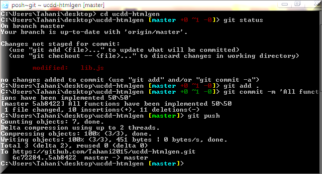

Tahani Almanie
=======

## Favorite Food

Italian and Indian Food

## Favorite Programming Language

JavaScript

## Individual Learning Milestones for Week0 and Week1

1- I have implemented all the functions in lib.js (40 points).

 

2- I have committed and pushed my implementation to my own fork (10 points).

3- I have reported the number of points earned in the final commit message.

