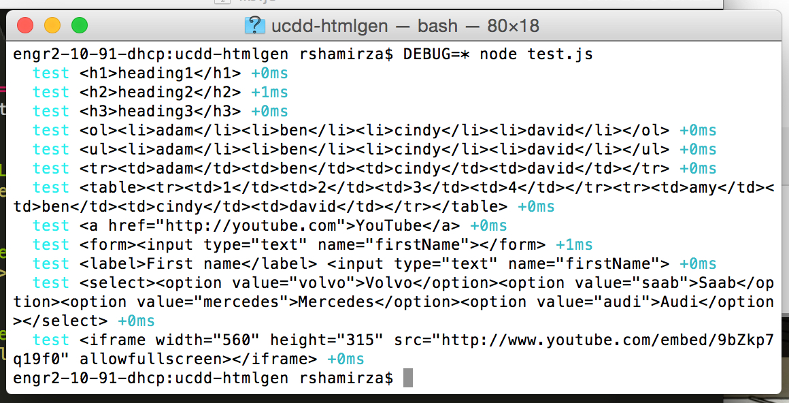
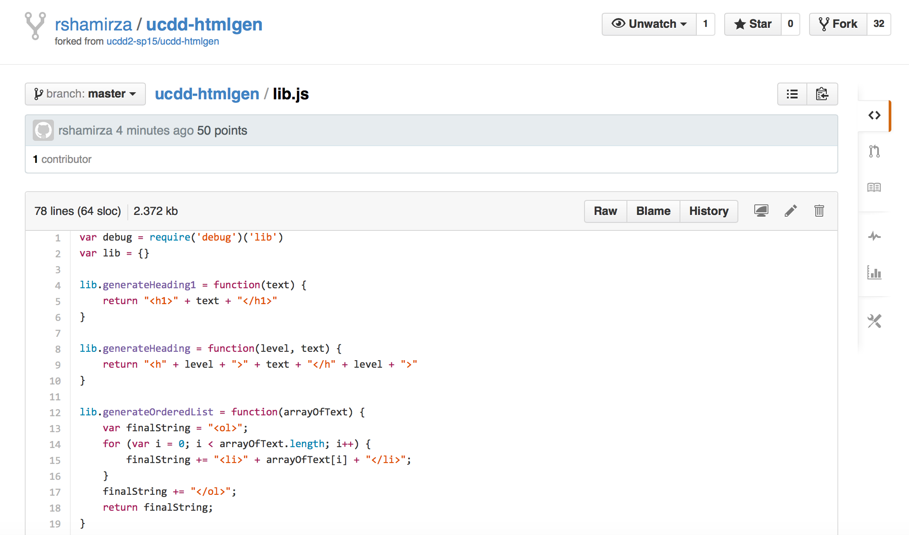
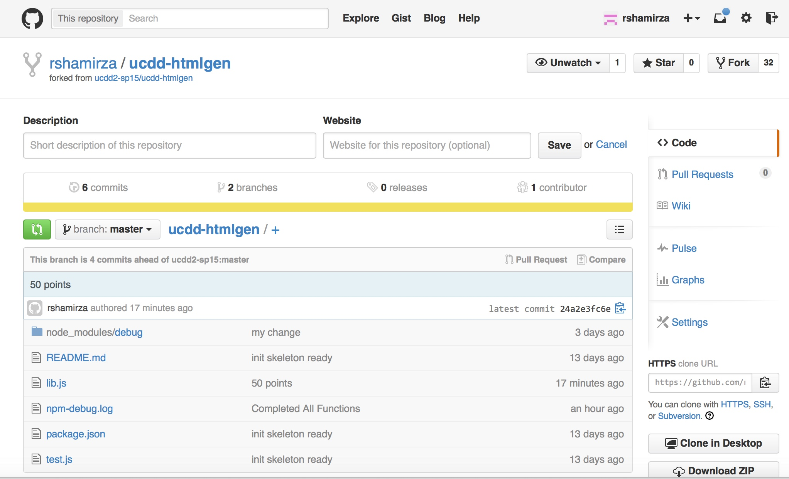

Rsha Mirza
==========

## Favorite Food

Steaks

Chocolates

## Favorite Programming Language

VB.Net

Lotus Notes

## Week 0 Milestones:

1- Have implemented ONE more function:

2- Have committed and pushed this implementation to one’s own fork:

## Week 1 Milestones:

1- Have implemented all functions in lib.js (40 points):

2- Have committed and pushed my implementation to my own fork (10 points):

